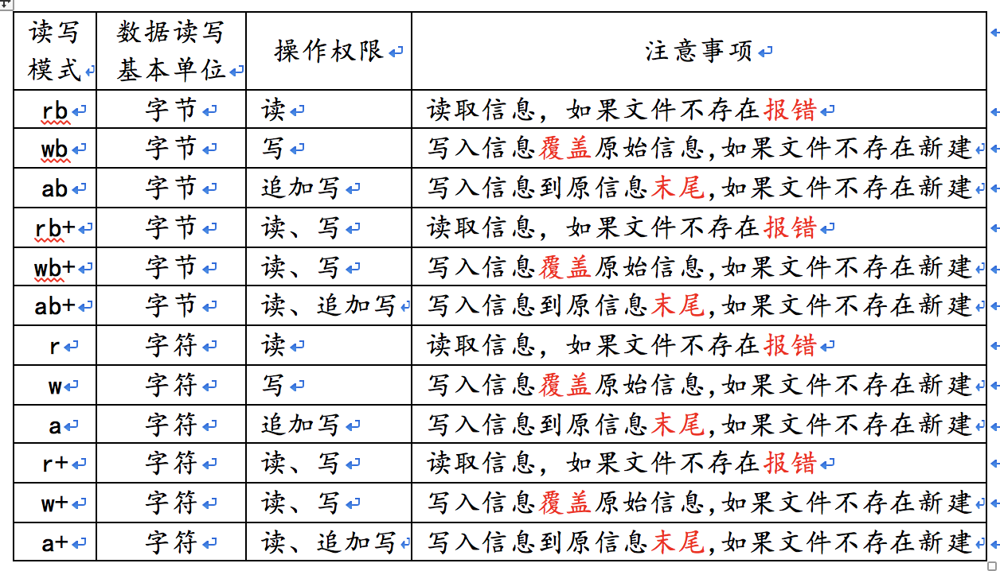
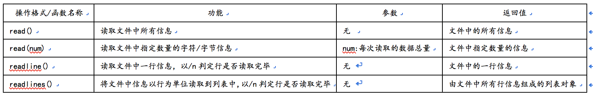
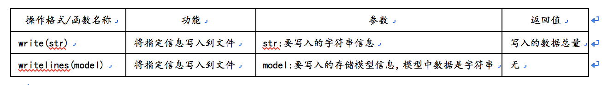
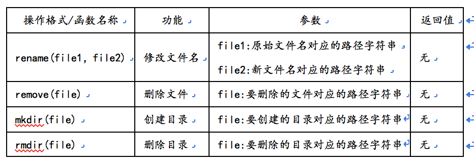

#文件操作
---
###目标：
	* 会对文件进行读取写入操作
---

####基本语法
```
格式一（手工关闭格式）：
	1.打开文件：	file = open("文件名","读写模式")
	2.操作文件：	*
	3.关闭文件:	file.close()
格式二（免关闭格式）：
	1.打开文件:	with open("文件名","读写模式") as file:
	2.操作文件:	*
	3.关闭文件(自动关闭文件)

```

####关于读写函数
<br>
<br>
<br>
<br>
- 注意：
	* 文件操作完毕后必须关闭，否则内存将长期保持对文件的连接状态，造成内存溢出的现象发生。


-  常见考核类型：
	* 选择题：文件操作、os模块函数
	* 代码题：文件读取与操作
	